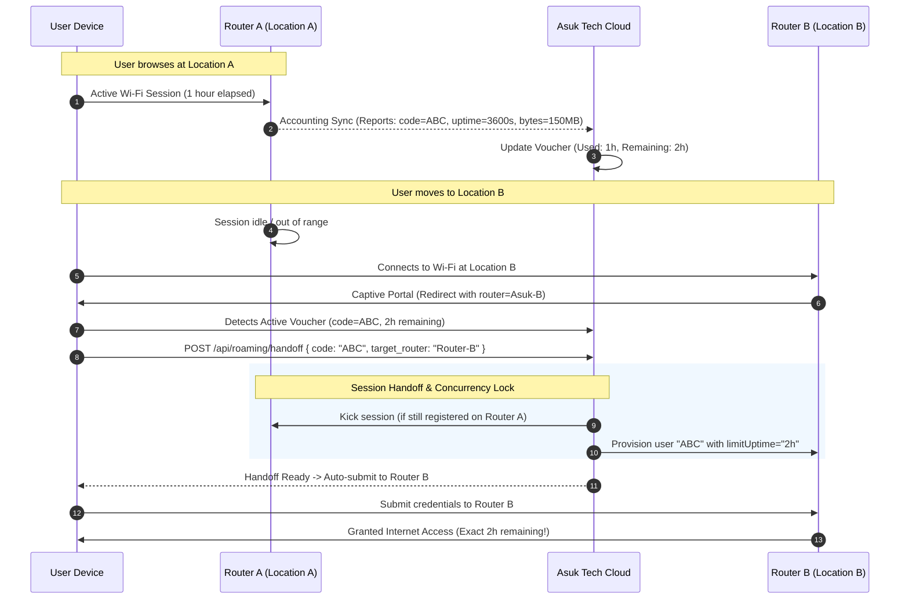

# 01. Architecture & Roaming Sync

> **Technical Deep-Dive**: How Asuk Tech maintains centralized session state and synchronizes usage across multiple independent MikroTik routers.

---

## 1. The Core Roaming Problem & Why Standalone MikroTik Fails

In standard MikroTik RouterOS:

- Hotspot users and their uptime counters are stored in the local memory of the specific router (`/ip/hotspot/user` and `/ip/hotspot/active`).
- Router A has **no awareness** of Router B.
- If a user buys a voucher on Router A and enters that code on Router B:
  1. Router B rejects the voucher with `"invalid username or password"` because the record does not exist in Router B's local table.
  2. If the administrator pre-generated the voucher on both routers, Router B's local counter starts at `00:00:00`, effectively granting the customer **double the time** they purchased!

---

## 2. Centralized Session Accounting Engine

Asuk Tech solves this by acting as the **Central Source of Truth** for voucher lifecycle, remaining balance, and active sessions:



---

## 3. Router Synchronization Mechanisms

Asuk Tech supports heterogeneous network topologies where some routers have public static IPs / DDNS and others are behind CGNAT / mobile 4G hotspots:

### Mode 1: Direct Mode (REST API via HTTPS)

- Applicable when the router has a public IP or Cloud DDNS (`*.sn.mynetname.net`).
- Asuk Tech makes real-time HTTPS calls to RouterOS v7 REST endpoints:
  - `POST /rest/ip/hotspot/user/add` with computed `limit-uptime = remaining_seconds`.
  - `POST /rest/ip/hotspot/active/remove` to kick lingering sessions upon roaming.
  - `GET /rest/ip/hotspot/active` for real-time bandwidth and uptime polling.

### Mode 2: Polling Mode (Zero-Port-Forwarding / CGNAT Support)

- Applicable for remote routers behind mobile networks or private subnets.
- Each router runs the lightweight `asuk-poll-agent` script on a 10-second interval:
  ```routeros
  /tool fetch url="https://asuktech.net/api/mikrotik/polling?router_id=UUID&secret=SECRET" ...
  ```
- **Task Dispatcher**: When a roaming handoff occurs, the cloud places a `create_hotspot_user` task in `pending_router_tasks` targeted specifically to `router_id = Router_B`.
- The router picks up the task within seconds, creates the temporary local credential, and acknowledges completion.

---

## 4. Continuous Accounting Reconciliation (The Heartbeat Loop)

To prevent data loss if a router reboots or a user walks away:

1. **Periodic Session Ingestion**:
   - Routers report active session snapshots every 2 minutes (either polled via REST or pushed via accounting script).
   - Ingested data includes:
     - `voucher_code`
     - `user_mac`
     - `uptime_seconds` (router's local elapsed time for current session)
     - `bytes_in` / `bytes_out`
2. **Delta Calculation**:
   - `session_delta = current_reported_uptime - last_checkpoint_uptime`
   - `voucher.remaining_uptime_seconds -= session_delta`
   - `voucher.total_bytes_used += (bytes_in_delta + bytes_out_delta)`
3. **Expiry Termination**:
   - When `voucher.remaining_uptime_seconds <= 0`:
     - Asuk Tech immediately marks voucher status as `'expired'`.
     - Dispatches kick commands to all routers associated with the account.

---

## 5. Security & Concurrency Enforcement

- **Anti-Sharing Rule**: Each voucher is strictly bound to `shared_users` configured on its plan (typically 1 device).
- **Handoff Preemption**: If a user device connects at Location B, the cloud immediately revokes the active session on Location A before issuing clearance at Location B. This guarantees that two friends cannot share one voucher across different buildings simultaneously.
- **Clock Drift Immunity**: Rather than relying on synchronized absolute wall-clock timestamps (NTP) across routers, Asuk Tech passes **relative session allowances** (`limitUptime = remaining_seconds`), making the system immune to router clock drift.
