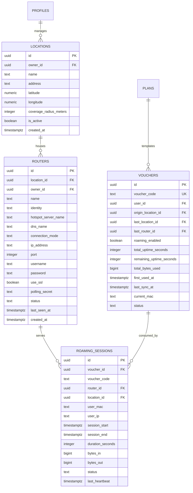

# 02. Database Schema & Migrations

> **Schema Specification**: Database models and migrations supporting multi-location router fleets, GPS geofencing, and roaming session ledgers.

---

## 1. Schema ER Diagram



---

## 2. SQL Migration Definitions

```sql
-- =========================================================================
-- Migration: Multi-Router Roaming & Location Platform
-- =========================================================================

-- 1. Locations Table (Physical sites with GPS boundaries)
CREATE TABLE IF NOT EXISTS public.locations (
  id UUID DEFAULT gen_random_uuid() PRIMARY KEY,
  owner_id UUID REFERENCES public.profiles(id) ON DELETE CASCADE,
  name TEXT NOT NULL,
  address TEXT,
  latitude NUMERIC(10, 7) NOT NULL,
  longitude NUMERIC(10, 7) NOT NULL,
  coverage_radius_meters INT DEFAULT 100 CHECK (coverage_radius_meters > 0),
  contact_phone TEXT,
  is_active BOOLEAN DEFAULT TRUE,
  created_at TIMESTAMPTZ DEFAULT NOW() NOT NULL,
  updated_at TIMESTAMPTZ DEFAULT NOW() NOT NULL
);

CREATE INDEX IF NOT EXISTS idx_locations_owner ON public.locations(owner_id);
CREATE INDEX IF NOT EXISTS idx_locations_coords ON public.locations(latitude, longitude);

-- 2. Routers Table (Individual MikroTik hardware devices)
CREATE TABLE IF NOT EXISTS public.routers (
  id UUID DEFAULT gen_random_uuid() PRIMARY KEY,
  location_id UUID REFERENCES public.locations(id) ON DELETE SET NULL,
  owner_id UUID REFERENCES public.profiles(id) ON DELETE CASCADE,
  name TEXT NOT NULL,
  identity TEXT NOT NULL, -- MikroTik /system/identity name (e.g., 'Asuk-R1-HQ')
  hotspot_server_name TEXT DEFAULT 'hotspot1',
  dns_name TEXT DEFAULT 'asuktech.net',
  connection_mode TEXT DEFAULT 'direct' CHECK (connection_mode IN ('direct', 'polling')),
  ip_address TEXT,
  port INT DEFAULT 443,
  username TEXT DEFAULT 'admin',
  password TEXT,
  use_ssl BOOLEAN DEFAULT TRUE,
  polling_secret TEXT UNIQUE DEFAULT encode(gen_random_bytes(24), 'hex'),
  status TEXT DEFAULT 'offline' CHECK (status IN ('online', 'offline', 'degraded')),
  model TEXT,
  ros_version TEXT,
  last_seen_at TIMESTAMPTZ,
  is_active BOOLEAN DEFAULT TRUE,
  created_at TIMESTAMPTZ DEFAULT NOW() NOT NULL,
  updated_at TIMESTAMPTZ DEFAULT NOW() NOT NULL
);

CREATE INDEX IF NOT EXISTS idx_routers_location ON public.routers(location_id);
CREATE INDEX IF NOT EXISTS idx_routers_identity ON public.routers(identity);
CREATE INDEX IF NOT EXISTS idx_routers_status ON public.routers(status);
CREATE INDEX IF NOT EXISTS idx_routers_polling_secret ON public.routers(polling_secret);

-- 3. Enhance Vouchers Table for Central Roaming Ledger
ALTER TABLE public.vouchers
  ADD COLUMN IF NOT EXISTS roaming_enabled BOOLEAN DEFAULT TRUE,
  ADD COLUMN IF NOT EXISTS origin_location_id UUID REFERENCES public.locations(id) ON DELETE SET NULL,
  ADD COLUMN IF NOT EXISTS last_location_id UUID REFERENCES public.locations(id) ON DELETE SET NULL,
  ADD COLUMN IF NOT EXISTS last_router_id UUID REFERENCES public.routers(id) ON DELETE SET NULL,
  ADD COLUMN IF NOT EXISTS total_uptime_seconds INT DEFAULT 0,
  ADD COLUMN IF NOT EXISTS remaining_uptime_seconds INT,
  ADD COLUMN IF NOT EXISTS total_bytes_used BIGINT DEFAULT 0,
  ADD COLUMN IF NOT EXISTS first_used_at TIMESTAMPTZ,
  ADD COLUMN IF NOT EXISTS last_sync_at TIMESTAMPTZ,
  ADD COLUMN IF NOT EXISTS current_mac TEXT;

CREATE INDEX IF NOT EXISTS idx_vouchers_last_router ON public.vouchers(last_router_id);
CREATE INDEX IF NOT EXISTS idx_vouchers_remaining_time ON public.vouchers(remaining_uptime_seconds);

-- 4. Central Roaming Sessions Ledger
CREATE TABLE IF NOT EXISTS public.roaming_sessions (
  id UUID DEFAULT gen_random_uuid() PRIMARY KEY,
  voucher_id UUID REFERENCES public.vouchers(id) ON DELETE CASCADE,
  voucher_code TEXT NOT NULL,
  router_id UUID REFERENCES public.routers(id) ON DELETE CASCADE,
  location_id UUID REFERENCES public.locations(id) ON DELETE SET NULL,
  user_mac TEXT NOT NULL,
  user_ip TEXT NOT NULL,
  session_start TIMESTAMPTZ DEFAULT NOW() NOT NULL,
  session_end TIMESTAMPTZ,
  duration_seconds INT DEFAULT 0,
  bytes_in BIGINT DEFAULT 0,
  bytes_out BIGINT DEFAULT 0,
  status TEXT DEFAULT 'active' CHECK (status IN ('active', 'closed', 'handed_off', 'expired')),
  last_heartbeat TIMESTAMPTZ DEFAULT NOW() NOT NULL
);

CREATE INDEX IF NOT EXISTS idx_roaming_voucher_active ON public.roaming_sessions(voucher_code, status);
CREATE INDEX IF NOT EXISTS idx_roaming_router ON public.roaming_sessions(router_id);
CREATE INDEX IF NOT EXISTS idx_roaming_mac ON public.roaming_sessions(user_mac);
```

---

## 3. Row Level Security (RLS) Policies

- **Public Client Access**: Users can query location public profiles (`name`, `address`, `latitude`, `longitude`, `coverage_radius_meters`) to render the coverage map and detect nearby hotspots.
- **Voucher Roaming Lookups**: Authenticated clients and guests with a valid voucher code can query active session state for their code.
- **Admin Isolation**: Router credentials and internal configuration are strictly restricted to Super Admin sessions or the router owner profile.
