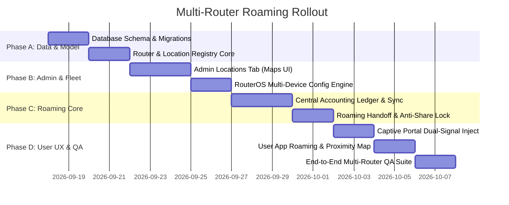

# 05. Implementation Phases & Milestones

> **Execution Roadmap**: Four structured milestones to build and verify the ISP-grade multi-router roaming platform.

---

## 📅 Roadmap Overview

---

## 🎯 Phase Breakdown

### Phase A: Schema & Data Layer
- **Goal**: Provision the database tables and migration versioning.
- **Deliverables**:
  - `supabase/migrations/20260917000002_multi_router_roaming.sql`.
  - Tables: `locations`, `routers`, `roaming_sessions`.
  - Schema modifications: `vouchers` (remaining seconds, bytes used, last router/location).
  - RLS policies and indexes.

### Phase B: Super Admin Location & Fleet Management
- **Goal**: Allow admins to visually add, edit, and monitor routers and locations on an interactive map.
- **Deliverables**:
  - `app/super-admin/components/LocationsTab.js` (Google Maps / Mapbox pin-dropping & radius circle).
  - Multi-router connection tester & system health monitoring.
  - Per-router RouterOS auto-setup script generator.

### Phase C: Roaming Accounting Engine & Handoff API
- **Goal**: Implement server-side cross-router session reconciliation and just-in-time provisioning.
- **Deliverables**:
  - `lib/roaming.js` — Core roaming controller (remaining time calculations, concurrency locks).
  - `/api/roaming/check-status` — Identifies active vouchers for a user/device at a given router.
  - `/api/roaming/handoff` — Kicks stale sessions and provisions remaining time on target router.
  - `/api/roaming/accounting-sync` — Periodic heartbeat ingestion updating voucher consumption deltas.

### Phase D: User App Experience & Captive Portal Roaming
- **Goal**: Delight users with zero-friction roaming and location-aware connectivity.
- **Deliverables**:
  - Updated captive portal templates in `lib/hotspotTemplates.js` injecting `$(identity)` and `$(server-name)`.
  - Client-side GPS detection and proximity alerts in user dashboard (`/status` and `/`).
  - One-tap "Resume Surfing at [Location]" modal.

---

## 🧪 Testing & Verification Matrix

| Scenario | Test Procedure | Expected Result |
|---|---|---|
| **Voucher Roaming Handoff** | Create voucher on Router A (3h limit). Consume 1h. Issue handoff to Router B. | Router A session kicked. Router B provisioned with exactly 2h limit. Total time preserved. |
| **Double-Use Prevention** | Attempt to use same voucher simultaneously on Router A and Router B. | Preemption kicks Router A before Router B connects. Only 1 concurrent device active. |
| **Multi-Signal Location** | Disable GPS in browser and load portal with `?router=Asuk-HQ`. | Location successfully resolved to HQ based on hardware identity parameter. |
| **GPS Geofence Match** | User browser coordinates within 50m of Location B. | App highlights Location B as active and displays nearby branch list. |
| **Polling Router Support** | Target Router B configured in polling mode. | Handoff queues task in `pending_router_tasks`; agent picks up and creates user within 10s. |
