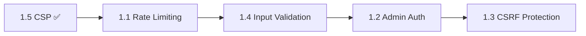

# Phase 1: 🔴 Security & Data Integrity

> **Timeline**: Week 1-2  
> **Priority**: CRITICAL — Must complete before going live with real money  
> **Status**: 🟡 Partially Done

---

## ⚠️ Why This Phase is Critical

These are the only items that could cause **real-world financial or security damage** if left unaddressed:
- An attacker can brute-force admin credentials (no rate limiting on auth)
- Admin passwords are stored in plaintext in the database
- No CSRF protection means a malicious page could trigger admin actions
- Unvalidated inputs could allow XSS or SQL injection

---

## Checklist

| # | Feature | Status | Effort | Files Affected |
|---|---------|--------|--------|----------------|
| 1.1 | [Rate Limiting](./1.1-rate-limiting.md) | 🟡 Lib built | Small | All API routes, `middleware.js` |
| 1.2 | [Admin Auth Hardening](./1.2-admin-auth-hardening.md) | ⬜ | Medium | `lib/admin-auth.js`, `api/super-admin/auth/`, `super-admin/page.js` |
| 1.3 | [CSRF Protection](./1.3-csrf-protection.md) | ⬜ | Small | New middleware, all POST/PUT/DELETE routes |
| 1.4 | [Input Validation](./1.4-input-validation.md) | 🟡 Zod installed | Medium | All API routes (new `lib/schemas/` directory) |
| 1.5 | [CSP Headers](./1.5-csp-headers.md) | ✅ Done | — | `next.config.mjs` |

---

## Implementation Order

> **Rationale**: Rate limiting first (prevents brute-force while other fixes are in progress), then input validation (foundational), then auth hardening (depends on validation), then CSRF (depends on session system from auth).

---

## Definition of Done

- [ ] All API routes have rate limiting applied
- [ ] Admin password is hashed with bcrypt/argon2
- [ ] JWT session tokens with 24h expiry replace Basic Auth
- [ ] CSRF tokens on all non-webhook POST/PUT/DELETE routes
- [ ] Zod schemas on all API request bodies
- [ ] All changes tested manually and build passes
- [ ] Security headers verified via [securityheaders.com](https://securityheaders.com)
